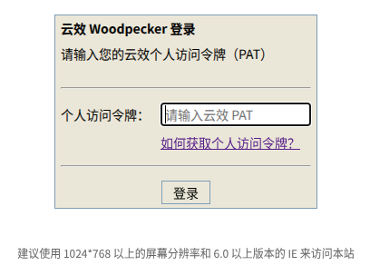

# yunxiao-woodpecker-addon

A [Woodpecker CI](https://woodpecker-ci.org) forge addon for [Codeup](https://codeup.aliyun.com).



## Build the addon

```sh
make build   # build the binary
make test    # run tests
```

## Usage with Docker Compose

Mount the addon directory into the `woodpecker-server` container and set the required environment variables:

```yaml
  woodpecker-server:
    environment:
      PLUGIN_UNIX_SOCKET_DIR: /var/lib/woodpecker # required
      WOODPECKER_ADDON_FORGE: /opt/addons/yunxiao-woodpecker-addon
      YUNXIAO_API_URL: https://openapi-rdc.aliyuncs.com
      YUNXIAO_ORGANIZATION_ID: <your_org_id> # not required for region version
      YUNXIAO_HOOK_SECRET: <your_webhook_secret> # not required but suggested
      # YUNXIAO_LOG_LEVEL: debug
      # WOODPECKER_LOG_LEVEL: debug

    volumes:
      - ./addons:/opt/addons/:ro
```
